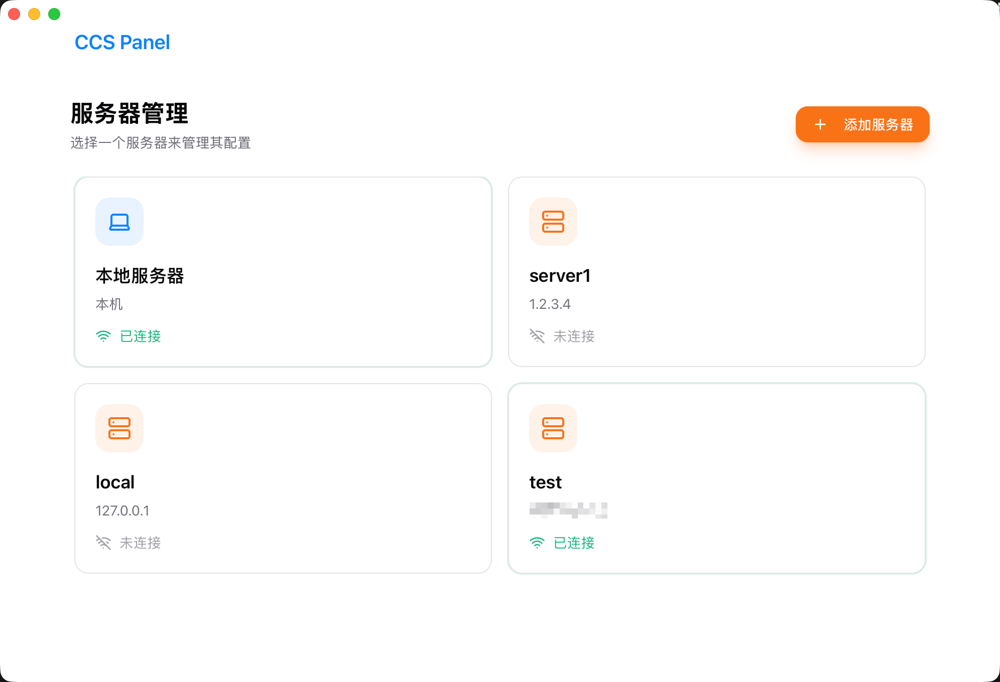
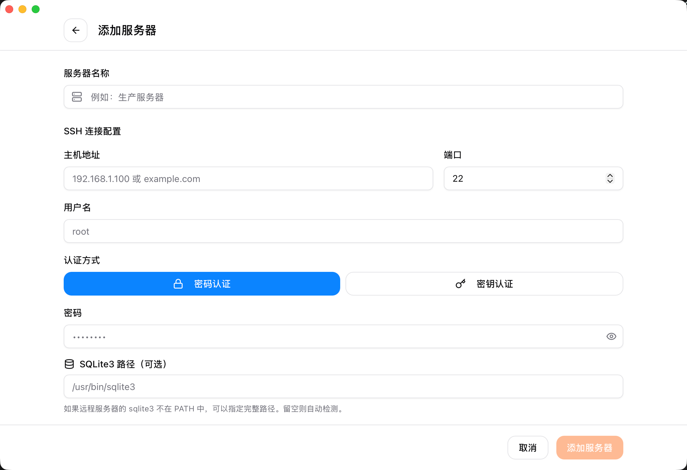

## ccs-panel

## Features
- Centrally manage Claude Code provider configurations for different SSH servers from your local machine.
- Developed based on [cc-switch](https://github.com/farion1231/cc-switch/) (commit: 395783e22a0bcd530ab883b9d8784d537c5ffac3); data format is compatible with cc-switch.

## Usage
**Please note: Due to updates in the cc-switch storage architecture, you must explicitly specify the path to the sqlite3 executable when adding new servers with ccs-panel. Automatic detection may not work as expected.**

- Build from source

```bash
## Usage
```bash
# 1. Clone the repository
git clone https://github.com/FanBB2333/ccs-panel.git
cd ccs-panel
# 2. Install dependencies
pnpm install
# 3. Start the app in development mode
pnpm tauri dev
# 4. Build the app for production
pnpm tauri build
```


## Interface Showcase
- Main Interface    
- Add Server Interface    

## WARNING
This project is currently under active iteration.


## Acknowledgements
- [cc-switch](https://github.com/farion1231/cc-switch)
- [CC-Switch-Web](https://github.com/Laliet/CC-Switch-Web)

